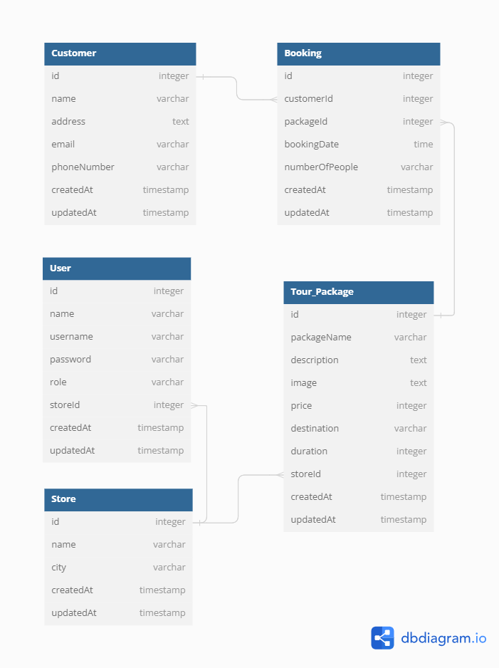

# Group 5 Back End Project Task

## Database Structure

     

## Privileged Detail

Manager :

- Manager bisa CRUD Tour Package untuk semua cabang (Store)
- Manager bisa CRUD booking untuk semua Store & Package
- Manager bisa CRUD Store
- Manager bisa CRUD Customer

Staff :

- Staff hanya bisa CRUD Tour Package untuk cabang dia saja (berdasarkan storeId)
- Staff bisa CRUD Booking untuk tour yang dibuat oleh cabang dia saja (berdasarkan storeId)
- Staff bisa CRUD Customer

## Business Logic

Customer datang ke toko -> kalo belum pernah daftar, maka customer didaftarkan oleh staff -> Jika sudah ada tinggal ambil customerId untuk field customerId yang ada di tabel booking

## Member Task

- Customer : Fitra
- User : Akbar
- Booking : Dhoni
- Store : Lowis
- Tour_Package : Azka

## Postman Documentation

[Documentation](https://documenter.getpostman.com/view/22728093/2sA3Bn7t9x)

## Feature

- Create Register User (/api/v1/auth/register)
- Create Auth Login (/api/v1/auth/login)
- Create Check User (/api/v1/auth/me)
- Create Middleware authenticate
